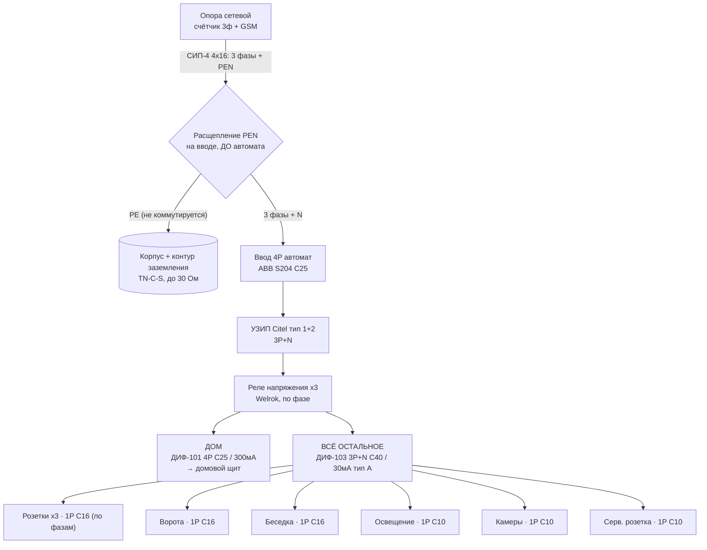

# ⚡ Уличный щиток (ВРУ на трубостойке)

> Актуализируй после каждого изменения в щите!
> Уличный вводно-распределительный щит на трубостойке. Домовой щиток — отдельно (позже), сюда заходит 3ф транзит на дом.

---

## Главное про этот щит

- **Счётчик сюда НЕ ставится** — он у сетевой на опоре (3ф, прямого включения, GSM). Щит без учёта: ввод + защита + распределение.
- Система **TN-C-S**: с опоры приходит СИП-4 4×16 (3 фазы + PEN, линия поверху). В щите PEN **расщепляется** на N и PE; PE → контур заземления (готов, ≤30 Ом).
- Ответвление от клеммной колодки счётчика до щита монтируешь сам (п. 11.1 ТУ).
- **Корпус куплен:** ЩРН IP66, металл, 48 мод. (4×12), глубина 155 мм, съёмная рама, замок (8600 ₽).

---

## Что обязательно по ТУ №20957166 (раздел 11.2)

Вводной аппарат с защитой от КЗ/перегрузки · **УЗИП** · **УЗО** · **реле контроля напряжения** · **заземление TN-C-S** (расщепление PEN + повторное заземление на контур ✅). Всё это в схеме есть.

---

## Схема (упрощённая: 2 ветки)

Логика: **общий вводной автомат → защита (УЗИП + реле напряжения) → две линии: дом (300 мА) и всё остальное (30 мА тип A).**

### Ввод и защита (общая часть)

| Позиция | Аппарат | Роль |
|---------|---------|------|
| Расщепление PEN | **На вводе, ДО автомата** (одна точка) — PEN → шины **N** и **PE** | PE отводится сразу, **не коммутируется**; N идёт в 4-й полюс автомата |
| PE | Шина PE → корпус + контур заземления | Повторное заземление PEN (≤30 Ом), в PE никаких автоматов |
| Ввод | **ABB S204, 4P, C25** — 3 фазы + N (после расщепления) | Главный автомат, отключение всего щита (25 А = 15 кВт) |
| ОПН | **УЗИП Citel тип 1+2 (DS134R), 3P+N** | Защита от импульсных перенапряжений (ввод воздушкой) |
| Контроль сети | **Реле напряжения Welrok d2-50 (1ф) — 3 шт., по фазе** | Рвёт свою фазу при перекосе/обрыве нуля |

> Реле по фазе (3 шт.) сами коммутируют нагрузку — контактор не нужен. Особенность: при аварии одной фазы дом продолжит питаться по двум оставшимся. Если нужна логика «всё или ничего» — заменить на одно 3ф реле + контактор.

### Ветка 1 — ДОМ (3ф транзит на будущий домовой щит)

| Аппарат | Кабель |
|---------|--------|
| **Dekraft ДИФ-101, 4P, C25 / 300 мА** (дифавтомат: автомат + противопожарное УЗО) | ВВГнг(А)-LS 5×6 в ПНД (длинная трасса — 5×10) |

> 300 мА защищает подземный фидер до дома от утечки. Личные **30-мА УЗО домовых групп ставятся в ДОМОВОМ щите**, не здесь.

### Ветка 2 — ВСЁ ОСТАЛЬНОЕ (через один дифавтомат 30 мА тип A)

Головной аппарат ветки: **Dekraft ДИФ-103, 3P+N, C40 / 30 мА, тип A**. От него — обычные 1P автоматы на линии:

| Линия | Автомат | Кабель | Фаза |
|-------|---------|--------|------|
| Розетка 1 (уличная) | 1P **C16** | ВВГ 3×2,5 | L1 |
| Розетка 2 (уличная) | 1P **C16** | ВВГ 3×2,5 | L2 |
| Розетка 3 (уличная) | 1P **C16** | ВВГ 3×2,5 | L3 |
| Ворота (привод) | 1P **C16** | ВВГ 3×2,5 в ПНД | L2 |
| Беседка | 1P **C16** | ВВГ 3×2,5 в ПНД | L3 |
| Освещение двора | 1P **C10** | ВВГ 3×1,5 | L1 |
| Камеры (БП/регистратор) | 1P **C10** | ВВГ 3×1,5 | L3 |
| Сервисная розетка в щите | 1P **C10** | — | L2 |
| Резерв | — | — | — |

> Компромисс: всё остальное под одним 30-мА — утечка в одной линии гасит всю ветку (розетки/ворота/свет/камеры). Для камер поэтому желателен ИБП.
> Тип **A** (не AC) — обязательно: ловит утечки от техники с электроникой (БП камер, зарядки, инструмент).
> Баланс по фазам: L1 — розетка 1, свет · L2 — розетка 2, ворота, серв. · L3 — розетка 3, беседка, камеры.

---

## Однолинейная схема

---

## Рекомендации

1. **Обогрев щита** — нагреватель + термостат (куплены): металл зимой собирает конденсат, вредно для реле и БП камер.
2. **Заземлить корпус** — PE на металлический корпус (обязательно).
3. **ИБП для камер** (маленький) — переживать срабатывания 30-мА и просадки.
4. **Розетки:** решить наружные IP54+ на корпусе (для инструмента удобнее) vs в щит IP20 (Finder — сервисные, открывать дверцу).
5. **Гермовводы снизу**, кабели петлёй-капельником.
6. **Маркировка** — подписать автоматы, схему на дверцу. Запас модулей в 48-м корпусе ~10 (обогрев/вольтметр учесть).

---

## Спецификация (начинка — куплено)

| Оборудование | Кол-во |
|--------------|:------:|
| ✅ Щит ЩРН IP66, 48 мод. (4×12), 155 мм, съёмная рама, замок — **куплен (8600 ₽)** | 1 |
| Автомат ABB S204 4P C25 (ввод) | 1 |
| УЗИП Citel тип 1+2 DS134R-280/G (3P+N) | 1 |
| Реле напряжения Welrok d2-50 (1ф) | 3 |
| Дифавтомат Dekraft ДИФ-101 4P C25 / 300 мА (дом) | 1 |
| Дифавтомат Dekraft ДИФ-103 3P+N C40 / 30 мА, тип A (всё остальное) | 1 |
| Автомат ABB S201 1P C16 | 3 |
| Автомат ABB S201 1P C20 | 3 |
| Автомат ABB S201 1P C10 | 3 |
| Розетка наружная ЭРА IP65 2P+E, 16 А | 1 |
| Розетки в щит Finder Schuko IP20 (сервис/по решению) | 3 |
| Нагреватель UNISPLIT 150 Вт + термостат SILART TBS-140 | 1 компл. |

> Розетки: рекомендую пустить на **C16** (под 2,5 мм²); купленные **C20** — под мощную нагрузку или в запас. Камеры лучше **C6**, но C10 рабочий вариант.

**Ещё докупить (расходники, не в основной корзине):**

- Провод ПуГВ **6 мм²** (коричн/чёрн/серый + синий) + **2,5 / 1,5 мм²** по цветам · есть ПуГВ 10 мм² ж/з (земля)
- Наконечники **НШВИ** (1,5/2,5/6) + НШВИ-2
- **Шина N (на изоляторе)** + **шина PE (ГЗШ)**
- **Кросс-модуль / распредблок 3ф+N** (развод фаз на реле и дифавтоматы)
- **Гермовводы (сальники)** снизу + заглушки на пустые модули

---

## Заземление

| Параметр | Значение |
|----------|----------|
| Тип | **TN-C-S** (расщепление PEN в этом щите, одна точка) |
| Контур | Уголки 50×50 + полоса, смонтирован 21.09.2026 ✅ |
| Сопротивление | Замерить при подключении (цель ≤ 30 Ом, лучше ≤ 10) |
| Молниезащита | Через УЗИП тип 1+2 |

> Правило TN-C-S: N и PE соединяются **только в точке расщепления PEN**. Дальше N (на изоляторе) идёт сквозь дифавтоматы к нагрузкам, PE — на корпус/контур. Второе соединение N с корпусом недопустимо.

---

> ⚠️ Схема — рабочий ориентир, не заверенный проект. Сечения под дом и распределение по фазам уточнить по факту; заземление и конфигурацию подтвердить у того, кто монтирует и меряет сопротивление. Я не электрик.
