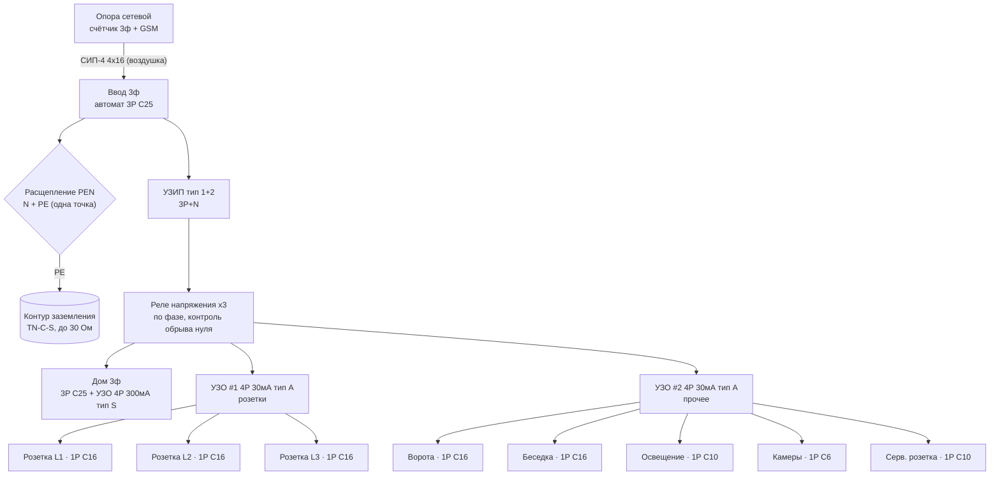

# ⚡ Уличный щиток (ВРУ на трубостойке)

> Актуализируй после каждого изменения в щите!
> Это **уличный вводно-распределительный щит** на трубостойке. Домовой щиток будет отдельно (позже) — сюда заходит 3ф транзит на дом.

---

## Главное про этот щит

- **Счётчик сюда НЕ ставится** — он у сетевой на опоре (3ф, прямого включения, с GSM). Значит щит **без учёта**, только ввод + защита + распределение.
- Система **TN-C-S**: с опоры приходит **СИП-4 4×16** (3 фазы + PEN, линию тянут поверху). В щите PEN **расщепляется** на N и PE; PE садится на **контур заземления** (готов, ≤30 Ом) — это повторное заземление.
- Ответвление от клеммной колодки счётчика до этого щита монтируешь сам (п. 11.1 ТУ).

---

## Что обязательно по ТУ №20957166 (раздел 11.2)

Щит (ВРУ) должен быть укомплектован:

1. **Вводной коммутационный аппарат** с защитой от КЗ и перегрузки (по мощности).
2. **УЗИП** — защита от импульсных перенапряжений.
3. **УЗО** — защита от токов утечки.
4. **Реле контроля напряжения** (повышенного/пониженного).
5. **Защитное заземление TN-C-S** — расщепление PEN + повторное заземление на контур (✅ контур смонтирован).

---

## Про УЗО — где какое (важно не путать)

- **30 мА (защита людей от удара)** — на конечных группах. В уличном щите: розетки и прочие уличные линии. **Личные 30-мА УЗО домовых групп (розетки/ванная/кухня в доме) ставятся в ДОМОВОМ щите**, не здесь.
- **300 мА, тип S (селективное), противопожарное** — стоит на фидере «дом» в этом щите. Оно НЕ для человека, а защищает **подземный кабель до дома** от утечки (перекопали/грызуны/влага). Тип S — с задержкой, чтобы первым срабатывало 30-мА в доме, а это не «слетало» заодно.

---

## Ввод и защита (общая часть)

| Позиция | Что ставим | Номинал | Зачем |
|---------|-----------|---------|-------|
| Ввод | Вводной автомат 3P | **C25** (по 15 кВт ≈ 22 А/фазу) | Главная защита + отключение всего щита |
| Расщепление | Шина PEN → шины **N** и **PE** (одна точка!) | — | Переход в TN-C-S |
| PE | Шина PE → корпус + контур заземления | — | Повторное заземление PEN (≤30 Ом) |
| ОПН | **УЗИП тип 1+2**, 3P+N | по паспорту | Обязательно по ТУ; тип 1+2 — т.к. ввод воздушкой |
| Контроль сети | **Реле напряжения ×3** (по фазе, со встроенным реле 40–63 А, напр. ZUBR/DigiTOP) | — | Обязательно по ТУ. Рвёт фазу при перекосе/**обрыве нуля** — критично для воздушки TN-C-S |

> Реле напряжения по фазе (3 шт.) само коммутирует нагрузку — отдельный контактор не нужен. Альтернатива: одно 3ф реле напряжения + контактор 3P 40 А.

---

## Отходящие группы — 2 УЗО на 30 мА + противопожарное на дом

**Дом (3ф транзит на будущий домовой щит):**

| Группа | Автомат | Защита от утечки | Кабель |
|--------|---------|------------------|--------|
| Дом 3ф | 3P **C25** | УЗО 4P 63A **300 мА тип S** (селективное, противопожарное) | ВВГнг(А)-LS **5×6** в ПНД (длинная трасса — 5×10) |

> Альтернатива вводному узлу дома: один **4P дифавтомат C25 / 300 мА / тип S** = автомат + УЗО в одном модуле (то же самое, компактнее). Берётся, если найдётся по адекватной цене; иначе пара автомат+УЗО дешевле и доступнее.

**УЗО #1 (4P, 40A, 30 мА, тип A) — розетки:**

| Группа | Автомат | Кабель | Фаза |
|--------|---------|--------|------|
| Розетка 1 (уличная IP54/66) | 1P **C16** | ВВГ 3×2,5 | L1 |
| Розетка 2 (уличная IP54/66) | 1P **C16** | ВВГ 3×2,5 | L2 |
| Розетка 3 (уличная IP54/66) | 1P **C16** | ВВГ 3×2,5 | L3 |

**УЗО #2 (4P, 40A, 30 мА, тип A) — прочие линии:**

| Группа | Автомат | Кабель | Фаза |
|--------|---------|--------|------|
| Ворота (привод) | 1P **C16** | ВВГ 3×2,5 в ПНД | L2 |
| Беседка | 1P **C16** | ВВГ 3×2,5 в ПНД | L3 |
| Освещение двора | 1P **C10** | ВВГ 3×1,5 | L1 |
| Камеры (БП/регистратор) | 1P **C6** | ВВГ 3×1,5 | L3 |
| Сервисная розетка в щите | 1P **C10** | — | L2 |
| Резерв ×2 | — | — | — |

> Вместо 5 дорогих дифавтоматов — обычные автоматы под общими УЗО. Компромисс: утечка в одной линии гасит всю группу под её УЗО. Для камер поэтому предусмотрен ИБП (см. рекомендации).
> Баланс по фазам: L1 — розетка 1, свет · L2 — розетка 2, ворота, серв. розетка · L3 — розетка 3, беседка, камеры · дом — все три.

---

## Что ещё рекомендую заложить (сверх базового списка)

1. **Обогрев щита** — нагреватель 10–50 Вт + термостат. Металлический шкаф на улице зимой собирает конденсат → вредно для реле, УЗО и БП камер.
2. **Индикация фаз** — 3 неонки или щитовой вольтметр с переключателем. Сразу видно, есть ли все три фазы.
3. **ИБП для камер** (маленький) — переживать короткие пропадания и срабатывания УЗО/реле напряжения.
4. **Ввод резерва (генератор)** на будущее — место под перекидной рубильник 3P + розетку генератора.
5. **Гермовводы (сальники) снизу**, кабели вводить снизу петлёй-капельником.
6. **Щит IP65/66**, металл, монтажная панель, замок; на 54–72 модуля (запас 20–30 %).
7. **Маркировка** — подписать автоматы, схему вклеить на дверцу.

---

## Однолинейная схема

---

## Спецификация (что покупать)

**Аппараты:**

| Оборудование | Кол-во |
|--------------|:------:|
| Щит металлический IP65/66, 54–72 мод., монт. панель, замок | 1 |
| Автомат 3P C25 (ввод) | 1 |
| Автомат 3P C25 (дом, транзит) | 1 |
| УЗИП тип 1+2, 3P+N | 1 компл. |
| Реле напряжения 1ф со встроенным реле 40–63 А (ZUBR/DigiTOP) | 3 |
| УЗО 4P 63A 300мА тип S (на дом, противопожарное) | 1 |
| УЗО 4P 40A 30мА тип A (розетки / прочее) | 2 |
| Автомат 1P C16 (розетки ×3, ворота, беседка) | 5 |
| Автомат 1P C10 (освещение, серв. розетка) | 2 |
| Автомат 1P C6 (камеры) | 1 |
| Розетка уличная IP54/66 | 3 |
| Нагреватель + термостат в щит (опция) | 1 |
| Вольтметр / индикация фаз (опция) | 1 |
| Перекидной рубильник 3P под генератор (опция, на будущее) | 1 |

**Сборка и расходники (без этого щит не собрать):**

- **Шина N** — на изоляторах, изолированная от корпуса; **шина PE (ГЗШ)** — на корпусе. Соединяются между собой **ровно в одной точке** — на вводе (расщепление PEN).
- **Провод от контура заземления в щит** — медь ≥10 мм² (ж/з) или полоса 40×4 с переходом на болт; **болт заземления** на корпусе, гайки/гроверы, наконечники **ТМЛ-10/16**, антикор на наружный контакт.
- **Монтажный провод ПуГВ (ПВ-3)** по цветам ГОСТ: фазы — коричневый/чёрный/серый, N — синий, PE — жёлто-зелёный. Сечения: ввод/сборка до УЗО и реле — **6 мм²**; отходящие перемычки — по номиналу (2,5 для C16, 1,5 для C10/C6, 6 для дома).
- **Наконечники НШВИ** на каждый гибкий провод в клемму (НШВИ-2 — где два провода в одну).
- **Гребёнки (шины-перемычки)** 1P и 3P для запитки рядов автоматов; **кросс-модуль / распределительный блок 3ф+N** для развода фаз с ввода на УЗИП, реле и УЗО.
- **Гермовводы (сальники) PG** нужных диаметров снизу щита + заглушки на лишние отверстия; **DIN-рейки** и **заглушки-пустышки** на свободные модули.
- **Ввод/ответвление от счётчика:** анкерный кронштейн + анкерный зажим для СИП на трубостойке; прокалывающие герметичные зажимы для перехода СИП→кабель; кабель ввода **ВВГнг(А)-LS**.
- **Инструмент:** пресс-клещи для НШВИ, стриппер, указатель напряжения/мультиметр, клещи для гребёнок.
- **Мелочёвка:** маркеры на провода и автоматы, стяжки/спираль для жгутов, бирки, наклейка со схемой на дверцу.

---

## Заземление

| Параметр | Значение |
|----------|----------|
| Тип | **TN-C-S** (расщепление PEN в этом щите, одна точка) |
| Контур | Уголки 50×50 + полоса, смонтирован 21.09.2026 ✅ |
| Сопротивление | Замерить при подключении (цель ≤ 30 Ом, лучше ≤ 10) |
| Молниезащита | Через УЗИП тип 1+2 |

> Правило TN-C-S: N и PE соединяются **только в точке расщепления PEN**. Дальше N (на изоляторе) идёт сквозь УЗО к нагрузкам, PE — на корпус/контур. Второе соединение N с корпусом недопустимо: ломает УЗО и выносит рабочий ток на корпуса.

---

> ⚠️ Схема — рабочий ориентир, не заверенный проект. Номиналы вводного и сечения под дом уточнить по фактической нагрузке; конфигурацию реле/УЗО и заземление подтвердить у того, кто монтирует и меряет сопротивление. Я не электрик.
