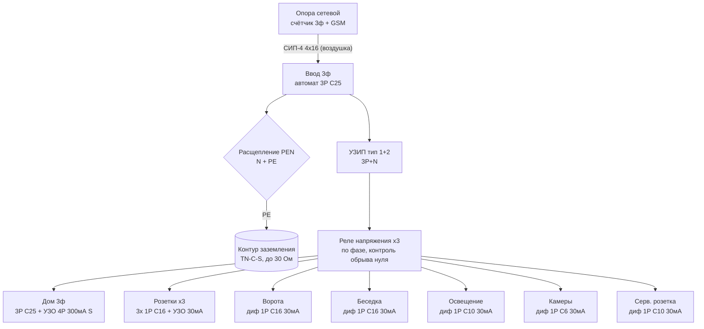

# ⚡ Уличный щиток (ВРУ на трубостойке)

> Актуализируй после каждого изменения в щите!
> Это **уличный вводно-распределительный щит** на трубостойке. Домовой щиток будет отдельно (позже) — сюда заходит 3ф транзит на дом.

---

## Главное про этот щит

- **Счётчик сюда НЕ ставится** — он у сетевой на опоре (3ф, прямого включения, с GSM). Значит щит **без учёта**, только ввод + защита + распределение.
- Система **TN-C-S**: с опоры приходит **СИП-4 4×16** (3 фазы + PEN, линию тянут поверху). В щите PEN **расщепляется** на N и PE; PE садится на **контур заземления** (готов, ≤30 Ом) — это повторное заземление.
- Ответвление от клеммной колодки счётчика до этого щита монтируешь сам (п. 11.1 ТУ).

---

## Что обязательно по ТУ №20957166 (раздел 11.2)

Щит (ВРУ) должен быть укомплектован:

1. **Вводной коммутационный аппарат** с защитой от КЗ и перегрузки (по мощности).
2. **УЗИП** — защита от импульсных перенапряжений.
3. **УЗО** — защита от токов утечки.
4. **Реле контроля напряжения** (повышенного/пониженного).
5. **Защитное заземление TN-C-S** — расщепление PEN + повторное заземление на контур (✅ контур смонтирован).

Всё это ниже уже заложено в схему.

---

## Ввод и защита (общая часть)

| Позиция | Что ставим | Номинал | Зачем |
|---------|-----------|---------|-------|
| Ввод | Вводной автомат 3P | **C25** (по 15 кВт ≈ 22 А/фазу) | Главная защита + отключение всего щита |
| Расщепление | Шина PEN → шины **N** и **PE** | — | Переход в TN-C-S |
| PE | Шина PE → контур заземления | — | Повторное заземление PEN (≤30 Ом) |
| ОПН | **УЗИП тип 1+2**, 3P+N | по паспорту | Обязательно по ТУ; тип 1+2 — т.к. ввод воздушкой |
| Контроль сети | **Реле напряжения ×3** (по фазе, со встроенным реле на 40–63 А, напр. ZUBR/DigiTOP) | — | Обязательно по ТУ. Рвёт фазу при перекосе/**обрыве нуля** — критично для воздушки TN-C-S |

> Реле напряжения по фазе (3 шт.) само коммутирует нагрузку — отдельный контактор не нужен. Альтернатива: одно 3ф реле напряжения + контактор 3P 40 А.

---

## Отходящие группы

| № | Группа | Автомат | Защита от утечки | Кабель | Фаза |
|---|--------|---------|------------------|--------|------|
| 1 | **Дом, 3ф транзит** (на будущий домовой щит) | 3P **C25** | УЗО 4P 63A **300 мА тип S** (селективное, противопожарное) | ВВГнг(А)-LS **5×6** в ПНД (при длинной трассе — 5×10) | L1+L2+L3 |
| 2 | **Розетки уличные ×3** (по 1 на фазу) | 3× 1P **C16** | общее УЗО 4P 40A **30 мА тип A** | ВВГ 3×2,5 на каждую | L1/L2/L3 |
| 3 | **Ворота** (привод) | дифавтомат 1P **C16 / 30 мА** | (встроено) | ВВГ 3×2,5 в ПНД | L2 |
| 4 | **Беседка** | дифавтомат 1P **C16 / 30 мА** | (встроено) | ВВГ 3×2,5 в ПНД | L3 |
| 5 | **Освещение двора** | дифавтомат 1P **C10 / 30 мА** | (встроено) | ВВГ 3×1,5 | L1 |
| 6 | **Камеры** (БП/регистратор) | дифавтомат 1P **C6 / 30 мА** | (встроено) | ВВГ 3×1,5 | L3 |
| 7 | **Сервисная розетка** в щите | дифавтомат 1P **C10 / 30 мА** | (встроено) | — | L2 |
| 8–9 | **Резерв** (2 места) | — | — | — | — |

> Каждая ответственная группа — на **своём** дифавтомате (утечка в розетке не гасит камеры/ворота). Розетки под одним УЗО — т.к. они на разных фазах, удобно 4-полюсным.

**Баланс по фазам:** L1 — розетка 1, свет · L2 — розетка 2, ворота, серв. розетка · L3 — розетка 3, беседка, камеры · дом — все три.

---

## Что ещё рекомендую заложить (сверх твоего списка)

1. **Обогрев щита** — нагреватель 10–50 Вт + термостат. Металлический шкаф на улице зимой собирает конденсат → вредно для реле, УЗО и БП камер. Дёшево, сильно продлевает жизнь начинке.
2. **Индикация фаз** — 3 неонки или щитовой вольтметр с переключателем. Сразу видно, есть ли все три фазы (при воздушке фаза может «отвалиться»).
3. **ИБП для камер** (маленький) — чтобы видеонаблюдение переживало короткие пропадания и срабатывания реле напряжения.
4. **Ввод резерва (генератор)** на будущее — место под перекидной рубильник 3P + розетку генератора. Просто заложить место.
5. **Гермовводы (сальники) снизу**, все кабели вводить снизу петлёй-капельником — вода не затечёт.
6. **Щит IP65/66**, металл, с монтажной панелью и замком; на 54–72 модуля (с запасом 20–30 %).
7. **Маркировка** — подписать автоматы, схему вклеить на дверцу.

---

## Однолинейная схема

---

## Спецификация (что покупать)

| Оборудование | Кол-во |
|--------------|:------:|
| Щит металлический IP65/66, 54–72 мод., с монт. панелью и замком | 1 |
| Автомат 3P C25 (ввод) | 1 |
| Автомат 3P C25 (дом, транзит) | 1 |
| УЗИП тип 1+2, 3P+N | 1 компл. |
| Реле напряжения 1ф со встроенным реле 40–63 А (ZUBR/DigiTOP) | 3 |
| УЗО 4P 63A 300мА тип S (на дом) | 1 |
| УЗО 4P 40A 30мА тип A (розетки) | 1 |
| Автомат 1P C16 (розетки) | 3 |
| Дифавтомат 1P C16 30мА (ворота, беседка) | 2 |
| Дифавтомат 1P C10 30мА (свет, серв. розетка) | 2 |
| Дифавтомат 1P C6 30мА (камеры) | 1 |
| Розетка уличная IP54/66 | 3 |
| Шины N и PE, гребёнки, гермовводы/сальники | компл. |
| Нагреватель + термостат в щит (опция) | 1 |
| Вольтметр/индикация фаз (опция) | 1 |
| Перекидной рубильник 3P под генератор (опция, на будущее) | 1 |

---

## Заземление

| Параметр | Значение |
|----------|----------|
| Тип | **TN-C-S** (расщепление PEN в этом щите) |
| Контур | Уголки 50×50 + полоса, смонтирован 21.09.2026 ✅ |
| Сопротивление | Замерить при подключении (цель ≤ 30 Ом, лучше ≤ 10) |
| Молниезащита | Через УЗИП тип 1+2 |

---

> ⚠️ Схема — рабочий ориентир, не заверенный проект. Номиналы вводного и сечения под дом уточнить по фактической нагрузке; конфигурацию реле/УЗО и заземление подтвердить у того, кто монтирует и меряет сопротивление. Я не электрик.
