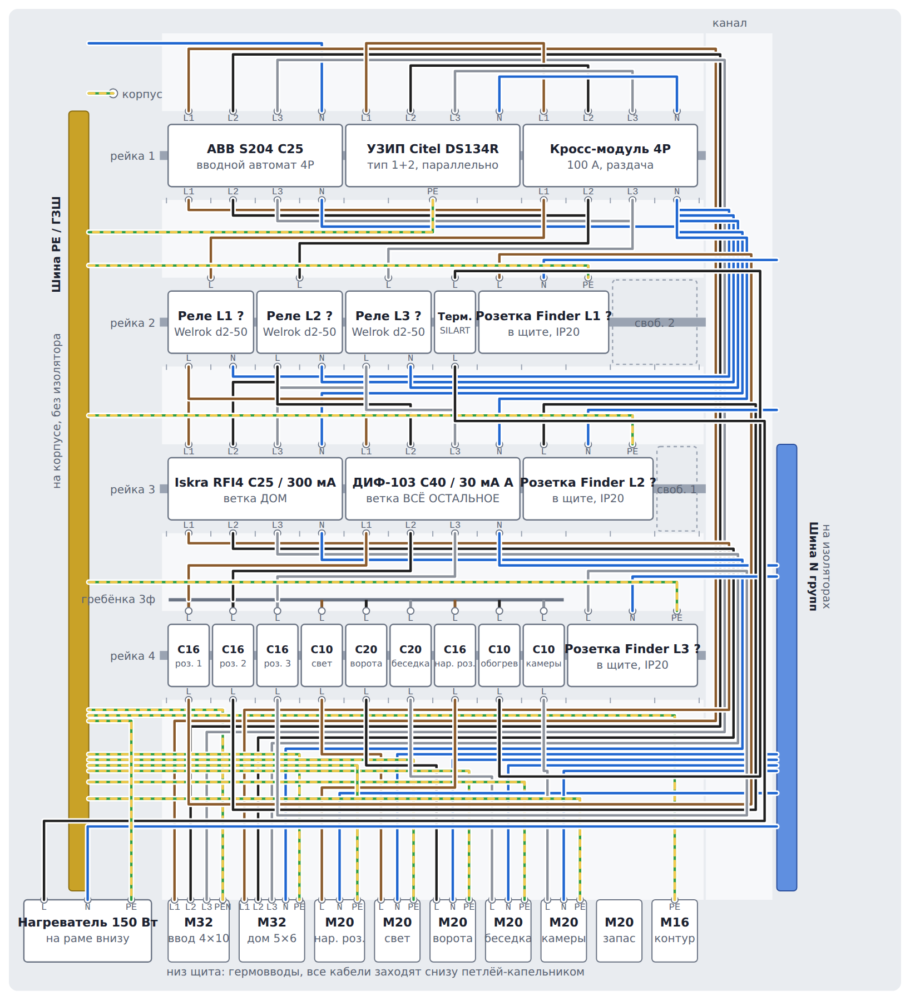

# ⚡ Уличный щиток (ВРУ на трубостойке)

> Актуализируй после каждого изменения в щите!
> Уличный вводно-распределительный щит на трубостойке. Домовой щиток — отдельно (позже), сюда заходит 3ф транзит на дом.

---

## Главное про этот щит

- **Счётчик сюда НЕ ставится** — он у сетевой на опоре (3ф, прямого включения, GSM). Щит без учёта: ввод + защита + распределение.
- Система **TN-C-S**: с опоры приходит СИП-4 4×16 (3 фазы + PEN, линия поверху). В щите PEN **расщепляется** на N и PE; PE → контур заземления (готов, ≤30 Ом).
- Ответвление от клеммной колодки счётчика до щита монтируешь сам (п. 11.1 ТУ). **Узел ввода:** СИП-4 4×16 до анкерного кронштейна на трубостойке → после анкера **прокалывающие зажимы Al/Cu** (4 шт.) → медь **ВВГнг(А)-LS 4×10** внутри стойки → гермоввод M32 снизу щита. Сам СИП в щит не заводится (алюминий в клеммы автоматов нельзя). Хвосты СИП закрыть колпачками, концами вниз.
- **Корпус куплен:** ЩРН IP66, металл, 48 мод. (4×12), глубина 155 мм, съёмная рама, замок (8600 ₽).

---

## Что обязательно по ТУ №20957166 (раздел 11.2)

Вводной аппарат с защитой от КЗ/перегрузки · **УЗИП** · **УЗО** · **реле контроля напряжения** · **заземление TN-C-S** (расщепление PEN + повторное заземление на контур ✅). Всё это в схеме есть.

---

## Схема (упрощённая: 2 ветки)

Логика: **общий вводной автомат → защита (УЗИП + реле напряжения) → две линии: дом (300 мА) и всё остальное (30 мА тип A).**

### Ввод и защита (общая часть)

| Позиция | Аппарат | Роль |
|---------|---------|------|
| Расщепление PEN | **На вводе, ДО автомата** (одна точка) — PEN → шины **N** и **PE** | PE отводится сразу, **не коммутируется**; N идёт в 4-й полюс автомата |
| PE | Шина PE → корпус + контур заземления | Повторное заземление PEN (≤30 Ом), в PE никаких автоматов |
| Ввод | **ABB S204, 4P, C25** — 3 фазы + N (после расщепления) | Главный автомат, отключение всего щита (25 А = 15 кВт) |
| ОПН | **УЗИП Citel тип 1+2 (DS134R), 3P+N** | Защита от импульсных перенапряжений (ввод воздушкой) |
| Контроль сети | **Реле напряжения Welrok d2-50 (1ф) — 3 шт., по фазе** | Рвёт свою фазу при перекосе/обрыве нуля |

> Реле по фазе (3 шт.) сами коммутируют нагрузку — контактор не нужен. Особенность: при аварии одной фазы дом продолжит питаться по двум оставшимся. Если нужна логика «всё или ничего» — заменить на одно 3ф реле + контактор.

### Ветка 1 — ДОМ (3ф транзит на будущий домовой щит)

| Аппарат | Кабель |
|---------|--------|
| **Iskra RFI4-C-25/0.3, 4P, C25 / 300 мА** (дифавтомат: автомат + противопожарное УЗО) | ВВГнг(А)-LS 5×6 в ПНД (длинная трасса — 5×10) |

> 300 мА защищает подземный фидер до дома от утечки. Личные **30-мА УЗО домовых групп ставятся в ДОМОВОМ щите**, не здесь.
> Проверь по паспорту Iskra RFI4-C-25/0.3, есть ли у него задержка (индекс **S**, селективный). Если нет — работать будет, но при утечке в доме могут сработать и домовое 30 мА, и этот 300 мА одновременно.

### Ветка 2 — ВСЁ ОСТАЛЬНОЕ (через один дифавтомат 30 мА тип A)

Головной аппарат ветки: **Dekraft ДИФ-103, 3P+N, C40 / 30 мА, тип A**. От него — обычные 1P автоматы на линии:

| Линия | Автомат | Кабель | Фаза |
|-------|---------|--------|------|
| Розетка Finder 1 (в щите) | 1P **C16** | ПуГВ 2,5 | L1 |
| Розетка Finder 2 (в щите) | 1P **C16** | ПуГВ 2,5 | L2 |
| Розетка Finder 3 (в щите) | 1P **C16** | ПуГВ 2,5 | L3 |
| Освещение двора | 1P **C10** | ВВГ 3×1,5 | L1 |
| Ворота (привод) | 1P **C20** | ВВГ 3×2,5 в ПНД | L2 |
| Беседка | 1P **C20** | ВВГ 3×2,5 в ПНД | L3 |
| Наружная розетка ЭРА IP65 (на корпусе) | 1P **C16** | ВВГ 3×2,5 | L1 |
| Обогрев щита (термостат → нагреватель) | 1P **C10** | ПуГВ 1,5 | L2 |
| Камеры (БП/регистратор) | 1P **C10** | ВВГ 3×1,5 | L3 |

> Компромисс: всё остальное под одним 30-мА — утечка в одной линии гасит всю ветку (розетки/ворота/свет/камеры). Для камер поэтому желателен ИБП.
> Тип **A** (не AC) — обязательно: ловит утечки от техники с электроникой (БП камер, зарядки, инструмент).
> Порядок на рейке = фаза по гребёнке: L1 — Finder 1, свет, наружная розетка · L2 — Finder 2, ворота, обогрев · L3 — Finder 3, беседка, камеры.

---

## Монтажная схема (раскладка + провода)

- **[panel-layout.html](panel-layout.html)** — интерактивная: раскладка по рейкам, все 67 проводов, фильтры по проводникам (L1/L2/L3/N/PE) и этапам сборки, таблица «откуда → куда, сечение». Открывать в браузере (скачать файл или через артефакт в Claude).
- **[panel-layout.png](panel-layout.png)** — та же схема картинкой, на печать и на дверцу щита.

---

## Рекомендации

1. **Обогрев щита** — нагреватель + термостат (куплены): металл зимой собирает конденсат, вредно для реле и БП камер.
2. **Заземлить корпус** — PE на металлический корпус (обязательно).
3. **ИБП для камер** (маленький) — переживать срабатывания 30-мА и просадки.
4. **Розетки:** три Finder внутри щита, по одной на фазу, плюс одна ЭРА IP65 снаружи на корпусе. Наружная на своём C16 (четвёртый C16 докуплен), один C20 остаётся в запасе.
5. **Гермовводы снизу**, кабели петлёй-капельником.
6. **Маркировка** — подписать автоматы, схему на дверцу.
7. **Место:** занято 45 из 48 модулей (при Welrok по 2 модуля), свободно 3. Шины N/PE и нагреватель крепятся на раму, модули не занимают.

---

## Спецификация (начинка — куплено)

| Оборудование | Кол-во |
|--------------|:------:|
| ✅ Щит ЩРН IP66, 48 мод. (4×12), 155 мм, съёмная рама, замок — **куплен (8600 ₽)** | 1 |
| Автомат ABB S204 4P C25 (ввод) | 1 |
| УЗИП Citel тип 1+2 DS134R-280/G (3P+N) | 1 |
| Реле напряжения Welrok d2-50 (1ф) | 3 |
| Дифавтомат Iskra RFI4-C-25/0.3, 4P C25 / 300 мА (дом) | 1 |
| Дифавтомат Dekraft ДИФ-103 3P+N C40 / 30 мА, тип A (всё остальное) | 1 |
| Автомат ABB S201 1P C16 (3 Finder + наружная розетка) | 4 |
| Автомат ABB S201 1P C20 (ворота, беседка; третий в запас) | 3 |
| Автомат ABB S201 1P C10 | 3 |
| Розетка наружная ЭРА IP65 2P+E, 16 А (на корпусе) | 1 |
| Розетки в щит Finder Schuko IP20, по одной на фазу | 3 |
| Нагреватель UNISPLIT 150 Вт + термостат SILART TBS-140 | 1 компл. |

> Finder ×3 и наружная розетка на **C16 ×4**; C20 на ворота и беседку, третий C20 в запас. Камеры лучше **C6**, но C10 рабочий вариант. Ширина Welrok принята 2 модуля: если 3, третья Finder не влезет.

**Что ещё купить** → полный чек-лист с галочками: [shopping-list.md](shopping-list.md) (узел ввода, шины, провода по сечениям, наконечники, гермовводы, инструмент).

---

## Заземление

| Параметр | Значение |
|----------|----------|
| Тип | **TN-C-S** (расщепление PEN в этом щите, одна точка) |
| Контур | Уголки 50×50 + полоса, смонтирован 21.09.2026 ✅ |
| Сопротивление | Замерить при подключении (цель ≤ 30 Ом, лучше ≤ 10) |
| Молниезащита | Через УЗИП тип 1+2 |

> Правило TN-C-S: N и PE соединяются **только в точке расщепления PEN**. Дальше N (на изоляторе) идёт сквозь дифавтоматы к нагрузкам, PE — на корпус/контур. Второе соединение N с корпусом недопустимо.

---

> ⚠️ Схема — рабочий ориентир, не заверенный проект. Сечения под дом и распределение по фазам уточнить по факту; заземление и конфигурацию подтвердить у того, кто монтирует и меряет сопротивление. Я не электрик.
